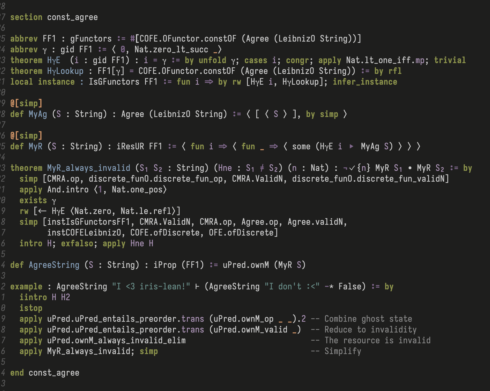

---
title:  'Eileen is Dead, Long Live Iris-Lean!'
date: 'May 5, 2025'
content: iris-lean'
...

Just a quick update for this one. 
Since my last post on Eileen, work has restarted on the main Iris-Lean project, and I've been contributing there instead. 
It's always a shame to see a good name go to waste, but I'm more than happy to give it up in exchange for a realistic shot at finishing the project.

Since the switch we've managed to finish a definition for `iProp`, and even get an example Iris proof working! 

{#id .class width=500}

 <i> Looks like everyone loves Iris-Lean ;) </i> 

We are coordinating on the `#iris-lean` channel in the [Lean Zulip](https://leanprover.zulipchat.com/#narrow/channel/490604-iris-lean/). 
New contributors are always welcome (for example Suhr, who took a heroic chunk out of the CMRA lemmas). 
If you message in the Zulip, I'm sure I'll be able to find you something to do!
