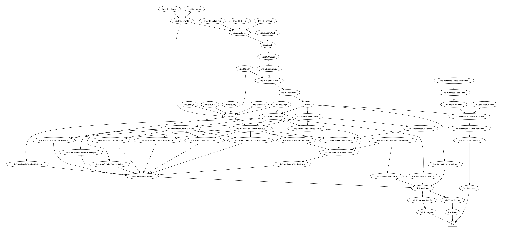

---
title:  'What does iris-lean do?'
date: 'Nov 17, 2024'
content: 'Iris'
...

The [``iris-lean``](https://github.com/leanprover-community/iris-lean) project aims to port Iris into Lean. 
As it stands now, the project is mainly a formalization of Iris Proof Mode frontend MoSeL. 

I want to understand concretely what ``iris-lean`` has accomplished, in order to judge how it might be used for mechanizing other separation logics in Lean. 
To do this, I worked my way up the project's import graph, and made an inventory of which kind of theorems are in each file. 

{#id .class width=700} 
[Higher-res version](../pdf/iris_lean_import_graph.pdf)

## Notes 

Here are my notes about what each file in the ``iris-lean`` repository does. 

- ``Iris.Std.Classes``
  - Typeclasses for basic properties about binary relations
  - Surely these are in ``mathlib`` somewhere
  - Does this relate to generalized rewriting

- ``Iris.Std.Tactic``
  - Basic helper tactics for manipulating goals
  - Seems generally useful 

- ``Iris.Std.Rewrite``
  - A more general rewriting tactic "for preorders with monotone rules on how to destruct operators."
  - Rewrites vary based on how many times they're performed
  - What is monotonicity in this context?
  - What is the differences between rewriting with monotonicity, and fully generalized rewriting?

- ``Iris.Std.DelabRule``
  - It has one tactic but I'm not sure what it does

- ``Iris.Std.BigOp``
  - "Big Operators" implemented with a left fold, with "unit" as base case
  - `LawfulBigOp f unit eq`: `f` is lawful with respect to an equality relation `eq`
  - Are all Iris BigOps lawful?

- ``Iris.BI.Notation``
  - Notation for iProps? 

- ``Iris.BI.BIBase``
  - Typeclass: embedding of a separation logic into `PROP : Type`
  - Seems to be a subset of the Iris base logic? Where exactly did this come from?
  - Tons of syntax and macros based on ``BIBase``

- ``Iris.Algebra.OFE``
  - Basic definitions for OFE's, COFE's, discrete COFE
  - No instances

- ``Iris.BI.BI``
  - Extends both ``BIBase`` and ``COFE``
  - Proof rules that must hold about the embedding
  - This typeclass could be split up into a Mathlib-like hierarchy 
  - Somehow connects back to ``rw_mono_rule``, registers that attribute for ``bi_sep_mono`` and ``persistently_mono``

- ``Iris.BI.Classes``
  - Typeclasses for various kinds of iProps (persistent, affine, absorbing, intuitionistic)

- ``Iris.BI.Extensions``
  - Extension of BI for affine logics
  - Makes me think that BI could be broken up more

- ``Iris.Std.TC``
  - Typeclass combinators 
  - I am astonished that there is any use for this
  - ``class inductive``, ``unif_hint``: none of these words are in the bible

- ``Iris.BI.DerivedLaws``
  - Lemmas that follow from the `BI` typeclass
  - I see "mono" lemmas, connected to ``rw_mono_rule``. Does that mean you can rewrite under them?
  - ``LawfulBigOp`` instance for:
    - ``and`` with equality ``BiEntails`` and unit ``True``
    - ``sep`` with equality ``BiEntails`` and unit ``emp``

- ``Iris.BI.Instances``
  - `Affine`, `Absorbing`, `Intuitionistic`, and `Persistent` instances for `BI` definitions

- ``Iris.Std.Expr``, ``Iris.Std.Nat``, ``Iris.Std.Prod``, ``Iris.Std.Expr``, ``Iris.Std.Qq``, ``Iris.Std.Equivalence``
  - Various helper functions, for both programming and metaprogramming

- ``Iris.Instances.Data.SetNotation``
  - Typeclass for disjointness, and notation ``(- || -)``

- ``Iris.Instances.Data.State``
  - ``State`` is a function ``Nat -> StateResult``, and ``StateResult`` is either "unknown", "result -", or "conflict"
    - I suppose this is their definition of memory for this instance
    - Doesn't the Iris base logic use a CMRA for this?
  - Disjoint states, "unknown" means outside of a heap fragment
  - Set operations on states

- ``Iris.Instances.Classical.Instance``
  - ``BI`` instance (resp. ``BIBase`` and discrete ``COFE``) for propositions over ``State`` (``HeapProp``)
  - ``BIBase`` is just lifting 
    - ``later`` does no step-indexing
    - ``persistently`` means the proposition is ``state``-irrelevant

- ``Iris.Instances.Classical.Notation``
  - "points to" ``HeapProp``

I didn't end up reading anything in ``ProofMode``, because Lean metaprogramming is still magical to me, and I'm happy to leave it as "that code works".
There is a single example in the repository. 

## What does ``iris-lean`` do, and what's next?

``iris-lean`` implements a collection of tactics against a particular axiomatization of separation logic. 

The most glaring deficiency in ``iris-lean`` is the fact that it's never actually instantiated.
Trying to do this for a simple separation logic (and mechanizing its adequacy theorem) would be an obvious next step. 
I suspect that in the process of doing this, one would need to break up the ``BIBase`` typeclass into smaller components---not every logic will have all of the features of Iris.
This could possibly be a fragment of one of the early logics presented in *Iris from the Ground Up*, but I think that might even be a little much at this point.

They also have no program logics developed on top of their separation logic. 
Implementing an analogue of the generic program logic code from Iris would probably require a lot of work. 
It would be nice if there was generic tactic-writing code for this. 

The results for ``OFE``s and ``COFE``s could be ported from regular Iris, since those have no dependencies in Iris. 
I'm curious about if any of this work can integrate into Mathlib. 

The ``README`` for ``iris-lean`` mentions an issue with generalized rewriting. 
I don't fully understand how they solve this issue with their ``rw'`` tactic in the development. 
Which features of generalized rewriting does ``iris-lean`` need, and what has changed since this project was under development?

## Code 

My [fork](https://github.com/markusdemedeiros/iris-lean) is updated to Lean ``4.14.0-rc2``.
The import graph was generated using [importGraph](https://reservoir.lean-lang.org/@leanprover-community/importGraph).
