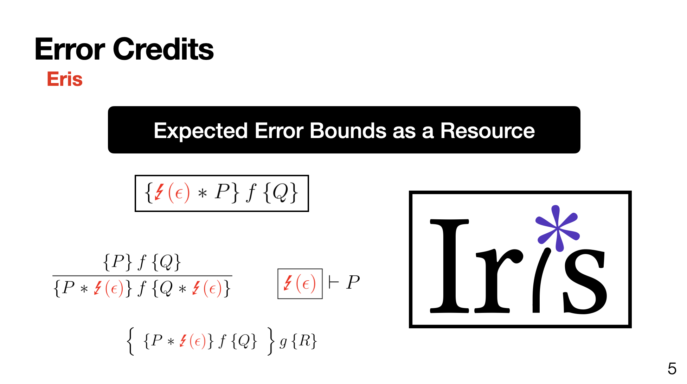

---
title:  "I've been a PhD student for a year. Now what?"
date: 'Aug 3, 2024'
content: 'academics'
...

I've been a PhD student for a year now. 
On paper, I'm about 20% of the way through my funding-- clearly this means that I just have to do the same thing four more
times, and clock out as a freshly minted doc, right?

And to think they told me grad school would be hard. 

Nevertheless, as the summer starts drawing to a close it seems like a good time to reflect on how things have gone so far, 
and how I can do better as I complete the rest of my PhD cakewalk. 
It's also a little bit of a retrospective on my choice to study with Joe Tassarotti at NYU, which I think was largely a 
very good one, even if at the time I had no idea why. 

## I've been a PhD student for a year

What did I do with it?

**Last year I published two papers with my research group**: [Eris](eris.html), and [Tachis](tachis.html). 
In both of these projects, I was one of seven coauthors. 
Despite the fact that my research group is rather large (playing abbreviation games to fit the page count is one thing... 
playing abbreviation games to fit the header limit is another) I felt that we were very well-coordinated on the 
projects we worked on last year. 

I feel very fortunate to have ended up in such a great research group-- the people, the project, and the timing lined up 
serendipitously for me as someone just starting out. 
The projects we worked on were ambitious enough for me to take meaningful ownership over aspects of the development,
but not so far-reaching that anyone's work felt inaccessible. 
A lot of my time last year was spent just getting my feet wet by mechanizing increasingly difficult problems; it was 
satisfying that each step of the way provided some value to the group alongside progressing my own skills.

(Of course it helps that everyone else in the group is friendly, smart, and fun.
As a whole I'd say we're pretty [magnificent](https://en.wikipedia.org/wiki/The_Magnificent_Seven).)

**Last year I applied for a scholarship** which was due in October.
Writing this application was challenging, and even through I didn't end up getting it I felt that it was a worthwhile exercise.
Specifically, the application involved arguing about the plan for and impact of my research-- which as a grad student 
toddler really meant understanding what research meant to _Joe_[^1]. 

One of my primary reasons for choosing to do my PhD at NYU was that I felt that Joe had a good instinct for 
choosing important and interesting problems to work on.
Spending time reflecting on Joe's vision, and arguing for it, set the tone between us in a very concrete way. 
Over the past year I can recall several times when knowing Joe's perspective helped keep me focused on the big picture, 
which is super valuable while I'm still developing my own sense of research taste.

**Last year I presented our work** at the [NESVD](nesvd.html) workshop. 
Despite a long history of hating presentations, it turns out that I love a crowd when it's something I really care about! 
The high point had to be pointing at a slide of Iris rules and calling it "eye candy for the deranged".

{#id .class width=500} 

I'm really looking forward to presenting more!

**Last year I attended some local workshops**. 
In total, I attended four. 
I like that I get so many chances to meet new people from the area (including semi-new computer-people, of course)!

I remember Ron Garcia pointing out it was great that there are so many excellent schools are so close together in the 
northeast. 
As is typical for my interactions with Ron, he was totally right, but at the time I had no idea how right he was. 

**Last year I started working at AWS**.
I work on [SampCert](https://github.com/leanprover/SampCert), a library for verifying differential privacy properties in Lean. 
A large part of my day-to-day is writing proofs about probabilistic programs in Lean-- it's a lot like my PhD research,
but I also get plenty of chances to hear from teams in totally different areas of verification too. 
It's been valuable to learn about the many meanings of *impact* in our field, several of which differ
from the meaning of *impact* I see written about in papers.
Blog post coming soon. 
Maybe. 

Of course, I'm super thankful that Joe is in close contact with the industry. 
This is another point I think I undervalued when choosing where to do my PhD: I'm not convinced that there's
a better way to understand which parts of your research are useful, than seeing them get put to use firsthand.

**Last year I was physically present in several classes**, and I was mentally absent for basically all of them. 
Without patting myself on the back too hard (god, that sounds like a dreadful effort) I think I've done a masterful 
job at putting in the absolute minimum effort possible to meet my grade requirements. 
As much as I'd like this title to say I *finished* my classes, I decided to drop a machine learning course after 45 minutes 
because it seemed like I couldn't slack off and write Rocq all class[^3]. 

When I chose NYU I was excited to take abstract interpretation with Patrick Cousot, and I was also enticed by the fact that 
the math and computer science departments were so tightly coupled. 
This turned out to be both irrelevant and untrue: all of my classes were total snores, and I basically never
have any reason to interact with the math department whatsoever. 
While I would have appreciated a separate math and CS department during my undergrad, coursework is so useless during my PhD
that it just does not matter. 

## Now what?

**Next year I want to understand our application domains better**. 
When it comes time to pick examples, Joe can usually point my in the direction of one, and I 
can usually understand it enough to grind out a proof.
However, my shallow understanding of probability, cryptography, distributed systems, and the thousand other 
topics that are tangential to our main line of work, doesn't help me come up with new and interesting 
directions we can explore.

The arrow of time is steadily marching me forward to the point where choosing a dissertation topic 
becomes a major issue; proactively reading about related topics is one way I can help myself pick
something compelling to work on when that time comes. 

**Next year I want to teach**.
I liked TAing during my undergrad, and I have to do it eventually anyways. 
It seems like I may be able to be a section leader for one of the undergraduate PL courses, and I'm 
looking forward to that!

**Next year I want to work on my research independence**.
I have been chewing on a new direction for our project for a few months, and I'm super excited to 
get back to working on it full-time. 
I've never really developed an idea from start to finish, and trying to take on more of a leading
role in a group research project is a big step towards that. 

I also want to spend time working on little, non-publishable projects (Joe please un-read that sentence).
At AWS, I saw several examples of how even just trying to get the technical part of verification working can lead to unexpected
design problems. 
While it's hard to make time for small projects, I think that making "getting my hands dirty" a priority 
will pay dividends when I'm looking for more cool paper ideas. 

**Next year I want to write more**!
I love to yap, and I especially love to yap about the technical stuff I'm working on.[^2]
Next year I want to try to document the things I'm figuring out, as it happens.
I find a lot of value in reading about other people's views on a topic, and writing outside
of a paper crunch could help my improve my technical explanation skills. 

## Conclusion

There is no conclusion to this. Ask me again in four to nine years if anything I wrote here is true.

[^1]: AKA "Joey T.", according to anonymous nickname-starting sources originating from Massachusetts.
[^2]: Since last August I've posted... holy shit I've posted 4600 times on Mastodon alone.
[^3]: The guy also started comparing the development of ChatGPT against human evolution, which, y'know, is a real dumb guy thing to do. 
